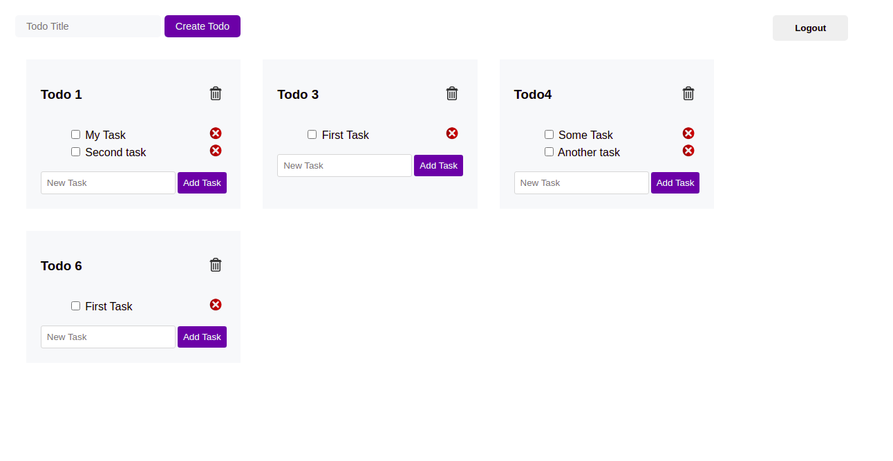
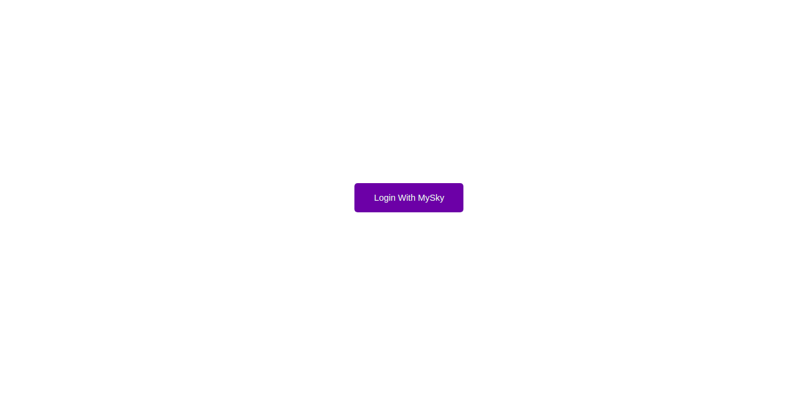

# Todo-Skapp

Todo-Skapp is a todo list-style Skynet application.

## Screenshots

## Built With

- React JS
- Redux
- JavaScript (ES6)
- MySky
- Skynet

## Live Demo

[Live demo link](https://relaxed-yonath-f0b0e7.netlify.app/)

## Getting Started
### Requirements

- Node JS >= v14
- Yarn >= v1.22

### To run the project locally

- Clone the [repository](https://github.com/Blaise-Shyaka/todo-skapp.git)
- Run `yarn install` to install dependencies
- Run `yarn start` and start the server

## Authors

👤 **Blaise SHYAKA**

- Github: [@Blaise-Shyaka](https://github.com/Blaise-Shyaka)
- Twitter: [@blaiseshyaka95](https://twitter.com/blaiseshyaka95)
- Linkedin: [blaise-shyaka](https://www.linkedin.com/in/blaise-pascal-shyaka)

## 🤝 Contributing

Contributions, issues and feature requests are welcome! 

- Fork the project
- Clone the project to your local machine
- Create a new branch  `git checkout -b your-branch-name`
- Make your contributions
- Push your branch up to your forked repository
- Open a Pull Request with a detailed description to the development branch of the original project for a review

## Show your support

If you loved this project, please hit the ⭐️ button.

## 📝 License

This project is [MIT](./LICENSE) licensed.